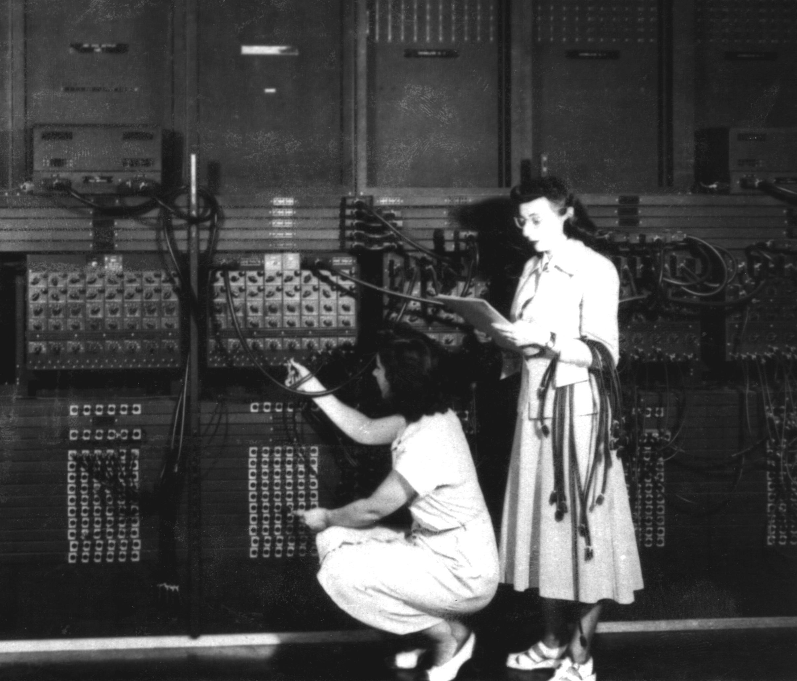
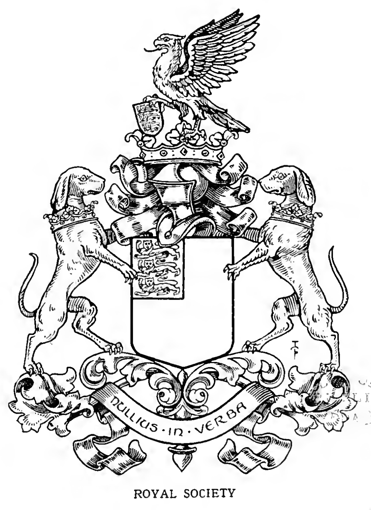
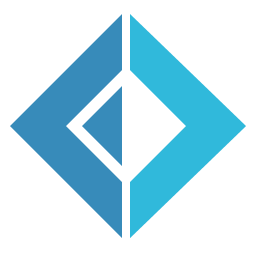
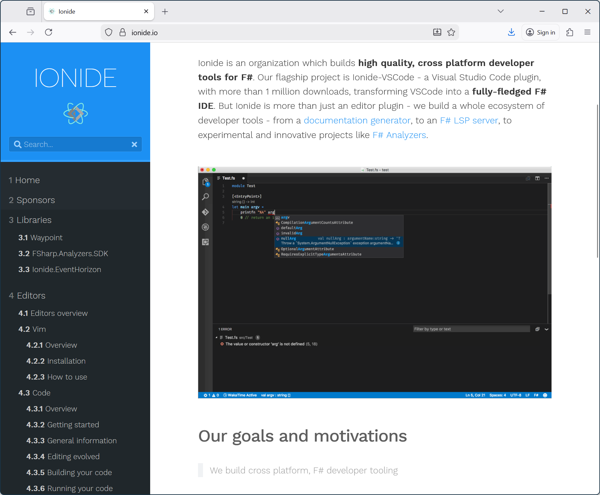

- title: Principles of Programming Languages - Lab #1 (NPRG084)

*****************************************************************************************
- template: title

# NPRG084
## **Lab #1**: Welcome & Lambda Calculus

---

**Tomáš Petříček**, 204 (2nd floor)  
_<i class="fa-brands fa-discord"></i>_ Materials available via course Discord!  
_<i class="fa fa-envelope"></i>_ [petricek@d3s.mff.cuni.cz](mailto:petricek@d3s.mff.cuni.cz)  
_<i class="fa-solid fa-circle-right"></i>_ [https://tomasp.net](https://tomasp.net) | [@tomasp.net](https://bsky.app/profile/tomasp.net)  

*****************************************************************************************
- template: subtitle

# Welcome
## Labs structure & credits

-----------------------------------------------------------------------------------------
- template: lists
- style: h1 { font-size:41pt; }

# Principles of Programming Languages



## Lectures

- Languages as subject of study
- Essential concepts
- Functional, OOP, imperative

## Labs

- Hands-on exploration
- How key concepts actually work
- Writing tiny interpreters

-----------------------------------------------------------------------------------------
- template: icons

# Labs
## What to expect

- *fa-box-archive* Based on Tiny Systems course (NPRG077)
- *fa-pen-to-square* Complete TODOs in a code skeleton
- *fa-clock-rotate-left* Hands-on 3 hour labs with laptops
- *fa-comments* Please ask me and/or your neighbors!
- *fa-calendar-days* Schedule is somewhat irregular, sorry...

-----------------------------------------------------------------------------------------
- template: content
- style: p, li { font-size:30pt; margin-bottom:6px; } p { margin-bottom:30px; }

# Labs - Preliminary schedule

**Room S10, Fridays 10:40-13:40**

- **7. Feb** - Welcome & Lambda calculus
- **20. March** - ML-like language interpreter
- **27. March** - Data types and type checking
- **17. April** - Imperative BASIC interpreter
- **24. April** - Object-oriented languages (TBC)
- **22. May** - Logic programming & unification

-----------------------------------------------------------------------------------------
- template: lists
- class: noborder

# Labs - How to get credits



## The idea

- Come to the labs & do the work here
- aka "Active Participation"
- This is the easiest option!

## The details

- Complete basic tasks for 4 out of 6 labs
- Send me a link to your repository
- Acknowledge collaboration & AI use

*****************************************************************************************
- template: subtitle

# F#
## Why and how

-----------------------------------------------------------------------------------------
- template: lists
- class: noborder

# F# language - why and how



## Code skeletons

- Code structure in F# with TODOs
- Just fill in the missing parts
- F# not required...

## Why stick with F#

- An interesting language to learn
- I can help you debug issues!
- Good editor and libraries
- Functional language is a great fit

-----------------------------------------------------------------------------------------
- template: image



# Getting F#

**Install .NET SDK**  
**Install VS Code**  
**Install Ionide**

[www.fsharp.org](https://www.fsharp.org)      
[www.ionide.io](https://www.ionide.io)

Other editors work, but setup auto-complete & background checking

-----------------------------------------------------------------------------------------
- template: icons

# Introducing F#
## Language and program structure

- *fa-angles-right* Program by composing expressions
- *fa-hashtag* Everything evaluates to a value
- *fa-not-equal* Statically typed with inference
- *fa-filter* Abstraction using functions


-----------------------------------------------------------------------------------------
- template: subtitle

# DEMO
## Introducing F#

-----------------------------------------------------------------------------------------
- template: icons

# F# Data types
## Representing information in F#

- *fa-circle-dot* **Int, strings, etc.** - primitive types
- *fa-circle-xmark* **Records, tuples** - representing combination
- *fa-circle-plus* **Discriminated unions** - representing choice
- *fa-circle-pause* **Lists, arrays** - representing repetition
- *fa-circle-exclamation* **More types...** - objects, interfaces, ...


-----------------------------------------------------------------------------------------
- template: subtitle

# DEMO
## Tuples, records, unions in F#

-----------------------------------------------------------------------------------------
- template: code
- class: smaller

```fsharp
type Expr =
  | Number of int
  | Mul of Expr * Expr
  | Div of Expr * Expr
```

# Writing interpreters

**Discriminated unions**  
For representing programs

-----------------------------------------------------------------------------------------
- template: code
- class: smaller

```fsharp
type Expr =
  | Number of int
  | Mul of Expr * Expr
  | Div of Expr * Expr

// Evaluate a given expression
eval : Expr -> int

// Returns 'None' when
// evaluation fails because of
// division by zero
safeEval : Expr -> option<int>
```

# Writing interpreters

**Discriminated unions**  
For representing programs

**Recursive functions**   
For implementing logic

**Option types**  
For representing errors!

-----------------------------------------------------------------------------------------
- template: subtitle

# DEMO
## Arithmetic expressions

*****************************************************************************************
- template: subtitle

# Lambda calculus
## Code structure and steps

-----------------------------------------------------------------------------------------
- template: code
- class: smaller
- style: .body2 pre { font-size:20pt; margin-top:8px; } .body2 pre code { margin-left:20px; }

```fsharp
// A term can be...
type Term =

  // 1. lambda term with
  // variable name & body
  | Lambda of string * Term

  // 2. application with
  // function & argument
  | Application of Term * Term

  // 3. reference to variable
  | Variable of string
```

# Representing terms

**Discriminated union!**

Example term $\lambda x.x$  

```text
Lambda("x", Variable("x"))
```

Example term $(\lambda x.x) y$:

```text
Application(
  Lambda("x", Variable("x")),
    Variable("y"))
```

-----------------------------------------------------------------------------------------
- template: code
- class: larger

```fsharp
// Replace variable of a given name
// with a given term, in a given term
// returning a new term
subst : string -> Term -> Term -> Term

// Produce string representation
format : Term -> string

// Try to reduce a term. Returns
// reduced term or 'None' if impossible
reduce : Term -> Option<Term>

// Apply 'reduce' as many times as
// possible and return the result
reduceAll : Term -> Term
```

# Implementing core logic

**Recursive functions!**

Arrow is right associative

Function types tell us a lot about what they do


-----------------------------------------------------------------------------------------
- template: content
- style: p, li { font-size:30pt; margin-bottom:6px; } p { margin-bottom:30px; }

# Lab #1 - Tasks

- **1. Basic** - Substitution, printing & free variables
- **2. Basic** - Call-by-name reduction strategy
- **3. Basic** - Call-by-value reduction strategy
- **4. (Bonus)** - Calculating with Church numerals
