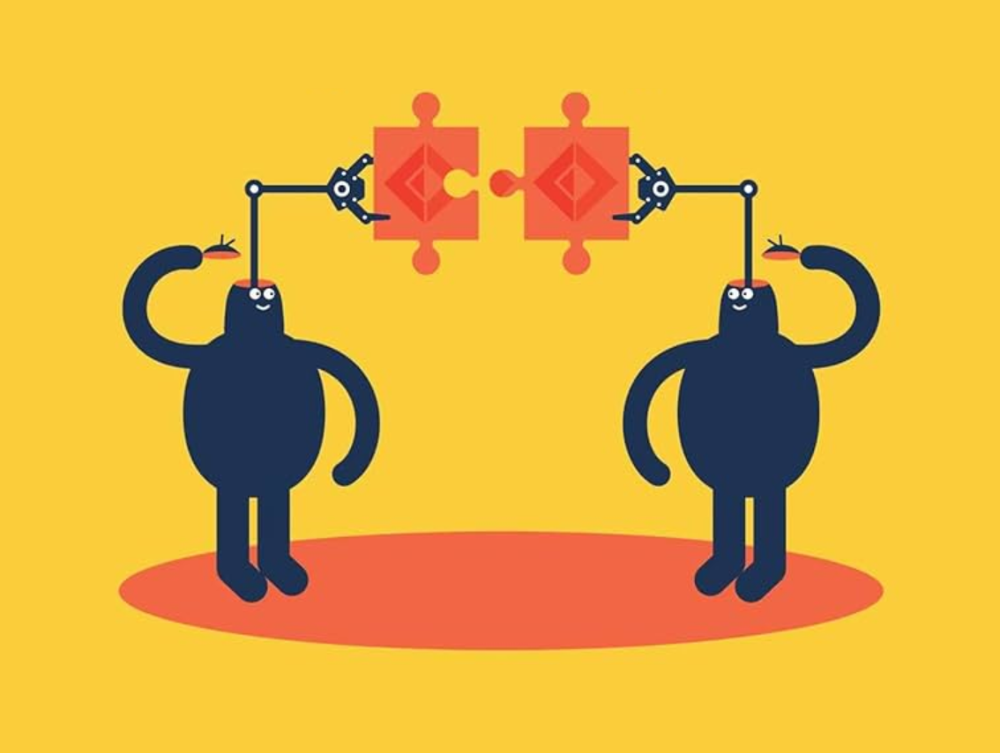
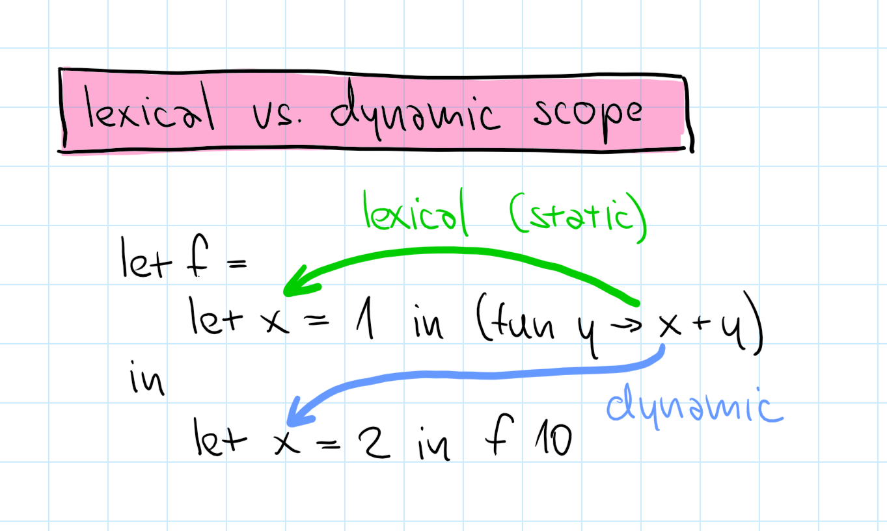
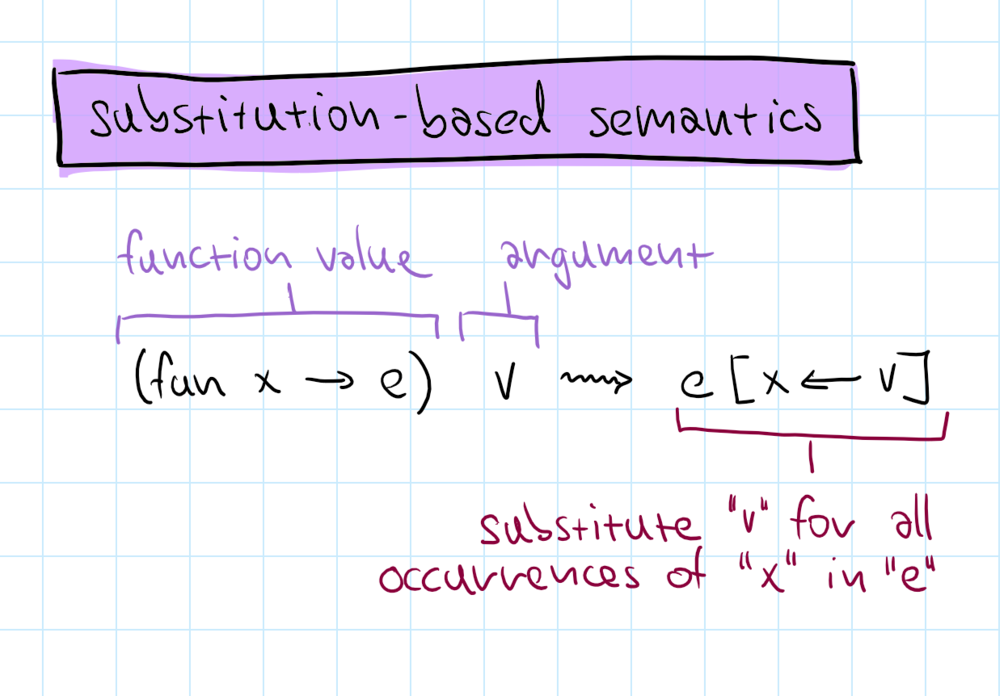
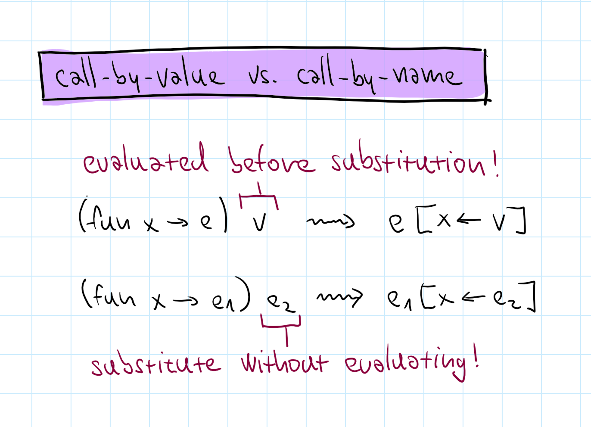

- title: Principles of Programming Languages - Lab #2 (NPRG084)

*****************************************************************************************
- template: title

# NPRG084
## **Lab #2**: ML-like language interpreter

---

**Tomáš Petříček**, 204 (2nd floor)  
_<i class="fa-brands fa-discord"></i>_ Materials available via course Discord!  
_<i class="fa fa-envelope"></i>_ [petricek@d3s.mff.cuni.cz](mailto:petricek@d3s.mff.cuni.cz)  
_<i class="fa-solid fa-circle-right"></i>_ [https://tomasp.net](https://tomasp.net) | [@tomasp.net](https://bsky.app/profile/tomasp.net)  

*****************************************************************************************
- template: subtitle

# Intro
## Useful F# features

-----------------------------------------------------------------------------------------
- template: largeicons

# Data type declarations in F#

- *fa-clipboard* **Tuples and records**  
  Store multiple values of different types
- *fa-code-fork* **Discriminated unions**  
  Represent one of multiple possible options
- *fa-bars* **Collections, lists and maps**  
  Multiple values of the same type
- *fa-arrow-rotate-right* **Recursive declarations**  
  Type that can include values of itself
- *fa-user-secret* **Type aliases**  
  Shorthand for a type with a long name

-----------------------------------------------------------------------------------------
- template: subtitle

# Demo
## Simple expression evaluator

-----------------------------------------------------------------------------------------
- template: lists

# Selected advanced features



## Collection types

- Linked (cons) lists with head/tail
- Immutable collections
- F# also has arrays and sequences

## Representing maps

- Key-value maps with lookup
- Immutable tree-based structure
- F# also has dictionaries

-----------------------------------------------------------------------------------------
- template: subtitle

# Demo
## Working with maps

*****************************************************************************************
- template: subtitle

# ML
## Language introduction

-----------------------------------------------------------------------------------------
- template: code

```ocaml
(* Functions *)
let f = (fun x -> 10 + x)
f 32

(* Tuples *)
let t = (1, "hi")
fst t
snd t

(* Unions *)
let c1 = Case1(10)
let c2 = Case2(32)
match c1 with
| Case1 n -> n + 32
| Case2 n -> n + 10
```

# Language features of our ML (1/2)

**Functions** but only with single argument

**Tuples** of two element with getters

**Unions** without tag name with two cases

-----------------------------------------------------------------------------------------
- template: code

```ocaml
(* Let bindings *)
let x = 10 in x * 32

(* Let desugaring *)
(fun x -> x * 32) 10

(* Conditionals *)
if e then 10 else 32

(* Both are expressions *)
1 + (if e then 41 else 1)
1 + (let x = 1 in x + x)

(* Currying *)
let add = fun a -> fun b -> a + b
in (add 10) 32
```

# Language features of our ML (2/2)

`let` is a syntactic sugar

Everything (`if` and `let` too) is an expression

Functions that return functions (currying) if
you need multiple parameters

-----------------------------------------------------------------------------------------
- template: image
- class: smaller



# Variable scoping

**Lexical**

Based on static block structure in code

Function value needs to capture variables (closure)

**Dynamic**

Based on dynamic evaluation structure

-----------------------------------------------------------------------------------------
- template: image



# Operational semantics

Formally specify how expression evaluate

**Substitution-based**

We do not need variable context!

-----------------------------------------------------------------------------------------
- template: image



# Call-by-name vs. call-by-value

**Call-by-value** (strict)

Evaluates function arguments first (ML)

**Call-by-name** (lazy)

Evaluates arguments when needed (Haskell)

*****************************************************************************************
- template: subtitle

# ML interpreter
## Code structure and steps

-----------------------------------------------------------------------------------------
- template: code
- class: smaller

```ocaml
type Expression =
  | Constant of int
  | Binary of
      string *
      Expression *
      Expression

val evaluate :
  Expression -> int
```

# Basic interpreter structure (0/2)

`Expression` is the source  
code that user writes

`evaluate` takes expression  
and returns the result

-----------------------------------------------------------------------------------------
- template: code
- class: smaller

```ocaml
type Value =
  | Number of int

type Expression =
  | Constant of int
  | Binary of
      string *
      Expression *
      Expression

val evaluate :
  Expression -> Value      
```

# Basic interpreter structure (1/2)

Adding values as the  
result of evaluation

`Value` is what we  
get as the result

`evaluate` takes expression  
and returns value


-----------------------------------------------------------------------------------------
- template: code
- class: smaller

```ocaml
type Value =
  | Number of int

type Expression =
  | Constant of int
  | Binary of   
      string *
      Expression *
      Expression
  | Variable of string

type VariableContext =
  Map<string, Value>

val evaluate :
  Expression -> VariableContext -> Value      
```

# Basic interpreter structure (2/2)

**Adding variables and variable context**

Variable can store only values (call-by-value)

`evaluate` takes context

-----------------------------------------------------------------------------------------
- template: subtitle

# Demo
## Adding values and variables

-----------------------------------------------------------------------------------------
- template: content
- style: p, li { font-size:30pt; margin-bottom:6px; } p { margin-bottom:30px; }

# Lab #2 - Tasks

- **1. (Demo)** - Simple numerical evaluator
- **2. Basic** - Unary operators and conditional
- **3. Basic** - Let with eager evaluation
- **4. Basic** - Let with lazy evaluation
- **5. Basic** - Functions and applications (dynamic)
- **6. Basic** - Functions and applications (lexical)
- **7. (Bonus)** - Adding the tuple data type
- **8. (Bonus)** - Adding the union data type
