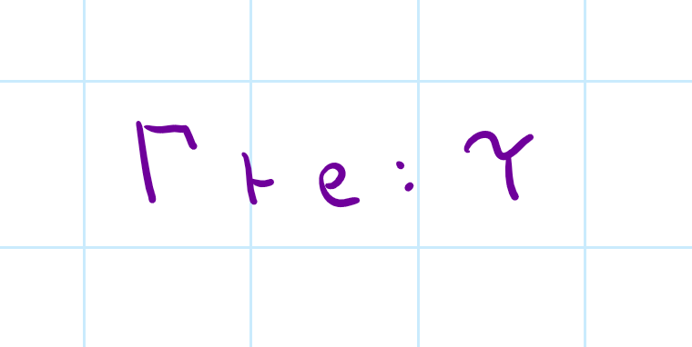
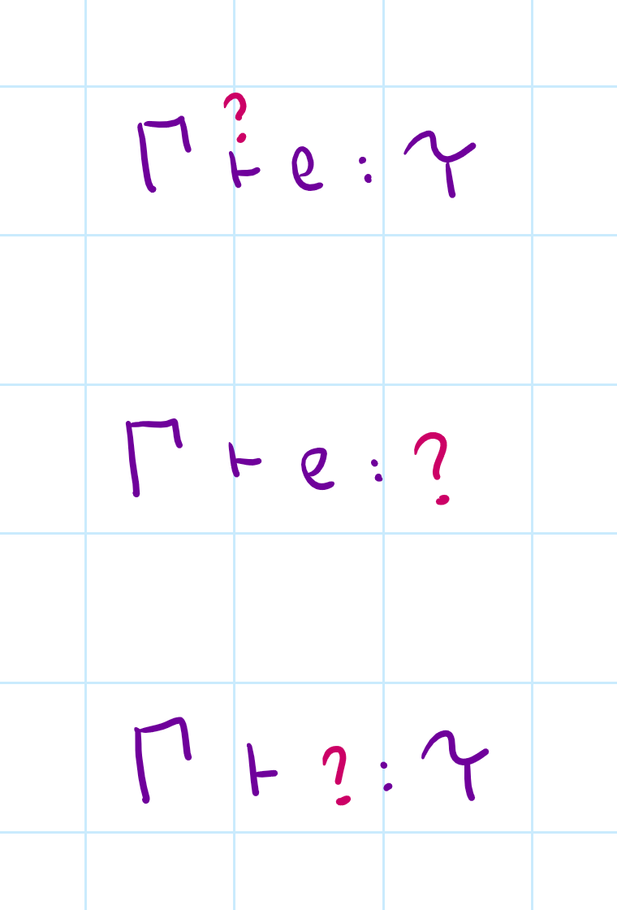
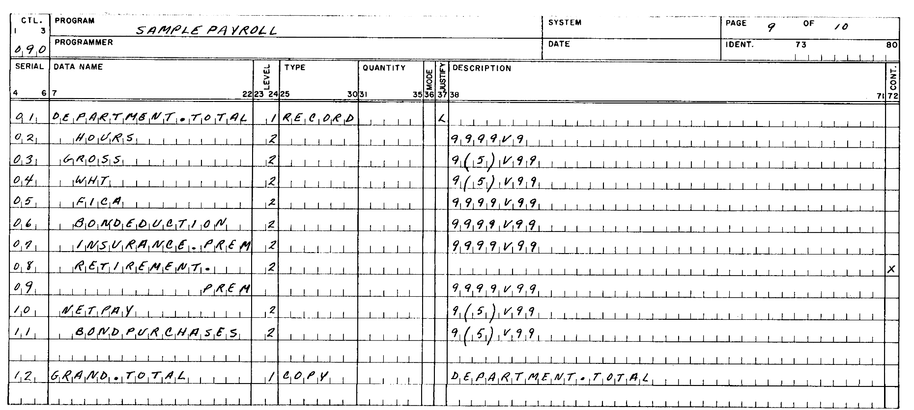
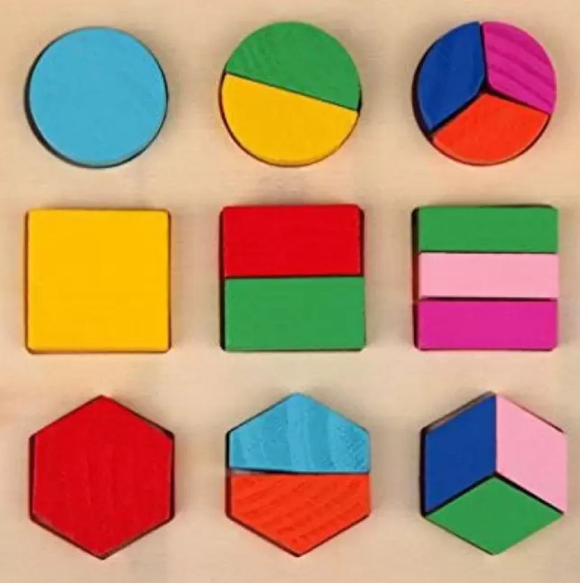

- title: Principles of Programming Languages - Lab #3 (NPRG084)

*****************************************************************************************
- template: title

# NPRG084
## **Lab #3**: Type checking ML-like programs

---

**Tomáš Petříček**, 204 (2nd floor)  
_<i class="fa-brands fa-discord"></i>_ Materials available via course Discord!  
_<i class="fa fa-envelope"></i>_ [petricek@d3s.mff.cuni.cz](mailto:petricek@d3s.mff.cuni.cz)  
_<i class="fa-solid fa-circle-right"></i>_ [https://tomasp.net](https://tomasp.net) | [@tomasp.net](https://bsky.app/profile/tomasp.net)  

*****************************************************************************************
- template: subtitle

# Types
## ML and type checking

-----------------------------------------------------------------------------------------
- template: code

```ocaml
(* Infer type of a variable *)
let x = 42

(* Infer more complex type *)
let nums = [1;2;3]

(* Infer type of a function *)
let add x = x + x

(* Optional type annotation *)
let add (x:float) = x + x

(* Check field access *)
let y = { Name="Yoda"; Age = 700 }
y.Name
```

# ML type checker

**Fully statically typed!**

You never write types


Unless you use .NET types or complex language features

**Type inference**  
vs. **Type checking**

-----------------------------------------------------------------------------------------
- template: subtitle

# Demo
## Type checking & inference in F#

-----------------------------------------------------------------------------------------
- template: lists
- class: bigger

# Type systems




## Typing rules

Given a typing context $\Gamma$, the   
expression $e$ has a type $\tau$

## The problem in general

We know some of these,  
want to figure out the rest

-----------------------------------------------------------------------------------------
- template: lists

# Type systems



## Type checking
- Know it all. Check derivation exists!
- Easy for syntax-driven rules

## Type inference
- Know expression. Figure out the type!
- Ideally most general (best) type

## Program synthesis
- Not very common, but interesting idea!

-----------------------------------------------------------------------------------------
- template: icons

# Types
## Different approaches

- *fa-keyboard* Write everything explicitly (Java)
- *fa-clock* Infer variable types from expressions (`var`)
- *fa-hand-sparkles* Infer most general polymorphic type
- *fa-dragon* Bi-directional type checking (infer/check)
- *fa-hammer* Infer expression types but annotate variables

*****************************************************************************************
- template: subtitle

# ML types
## Our goals

-----------------------------------------------------------------------------------------
- template: code

```ocaml
(* Check expressions *)
let num = 1 + 20
let err = 1 + "20"

(* Functions with annotations *)
(fun (x:int) -> x + 40)
(fun (x:int*string) -> snd x)

(* No annotation for let *)
let f = (fun (x:int) -> x + x)
f (f 10) + 2
```

# Our goal

**Limited type inference**

Infer type of expressions

Assuming we know types of all variables

-----------------------------------------------------------------------------------------
- template: code
- class: smaller

```fsharp
// POLYMORPHIC FUNCTIONS

// 'a -> ('a * 'a)
let dup a = (a, a)

// ('a * 'b) -> ('b * 'a)
let swap (a, b) = (b, a)

// 'a -> 'a
let id v = v

// INSTANTIATIONS

// (int * int)
dup 42         

// (string * int)
swap (1, "hi")
```

# Polymorphism

**Type variables**

Placeholder for any type  
Think generics in C#

---

**Unification**

Expecting `'a * 'b`  
Argument `int * string`

Find substitution  
`['a: int; 'b: string]`

-----------------------------------------------------------------------------------------
- template: lists
- class: bigger

# Record types



## F# record types

- Explicitly declared type
- `type Person`<br />&nbsp;&nbsp;  `{ Name:string; Age:int }`
- Property access `p.Age`

## Structural records

- No explicit definition
- `p.Age` requires `Age:int`
- Having more fields is allowed!

*****************************************************************************************
- template: subtitle

# ML types
## Code structure and steps

-----------------------------------------------------------------------------------------
- template: lists

# Constraint solver structure



## Simplest possible example
- Peano numbers: `Zero`, `Succ(x)`
- Equality constraints with variables
- e.g. `Succ(x) = Succ(Succ(Zero))`

## Creating a solver
- Discharge matching constraints
- Fail on mismatching constraints
- Generate more for matching nested
- Needs to handle substitutions...

-----------------------------------------------------------------------------------------
- template: subtitle

# Demo
## Solving numerical constraints

-----------------------------------------------------------------------------------------
- template: code
- class: smaller

```fsharp

type Type =
  // Two primitive types
  | Number
  | String

  // Function from t1 to t2
  | Function of Type * Type

  // Tuple with t1 and t2
  | Tuple of Type * Type

  // Later additions
  | TypeVariable of string

  // Record type
  | Record of Map<string, Type>
```

# Recursive data type!

- `int` (primitive)
- `string` (primitive)
- `int -> int`
- `int * string`
- `'a` (type variable)
- anonymous records

-----------------------------------------------------------------------------------------
- template: content

# Most important functions

Check expression and infer the resulting type

```fsharp
typeCheck : Expression -> Type
```

Unification for solving type variables

```fsharp
unify : list<Type * Type> -> Map<string, Type>
```

Substitution to replace type variables

```fsharp
substitute : Map<string, Type> -> Type -> Type
```

-----------------------------------------------------------------------------------------
- template: content
- style: p, li { font-size:30pt; margin-bottom:6px; } p { margin-bottom:30px; }

# Lab #3 - Tasks

- **0. (Demo)** - Numerical constraint solver
- **1. Basic** - Simple type checker
- **2. Basic** - Adding functions and let
- **3. Basic** - Supporting tuple types
- **4. Basic** - Adding limited polymorphism
- **5. (Bonus)** - Checking records with subtyping
