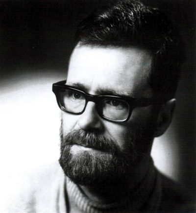
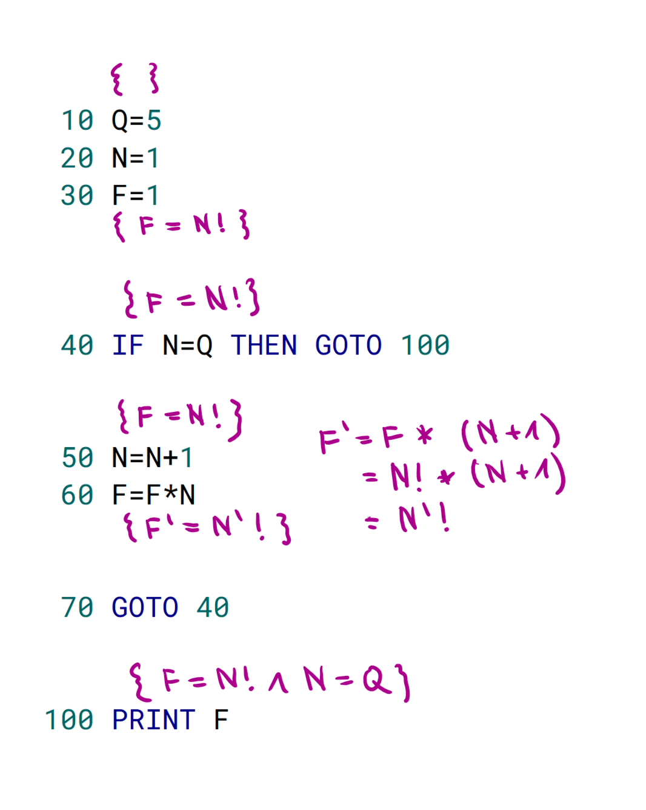
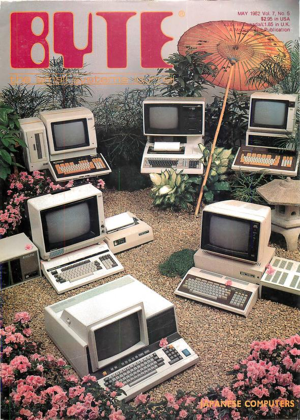
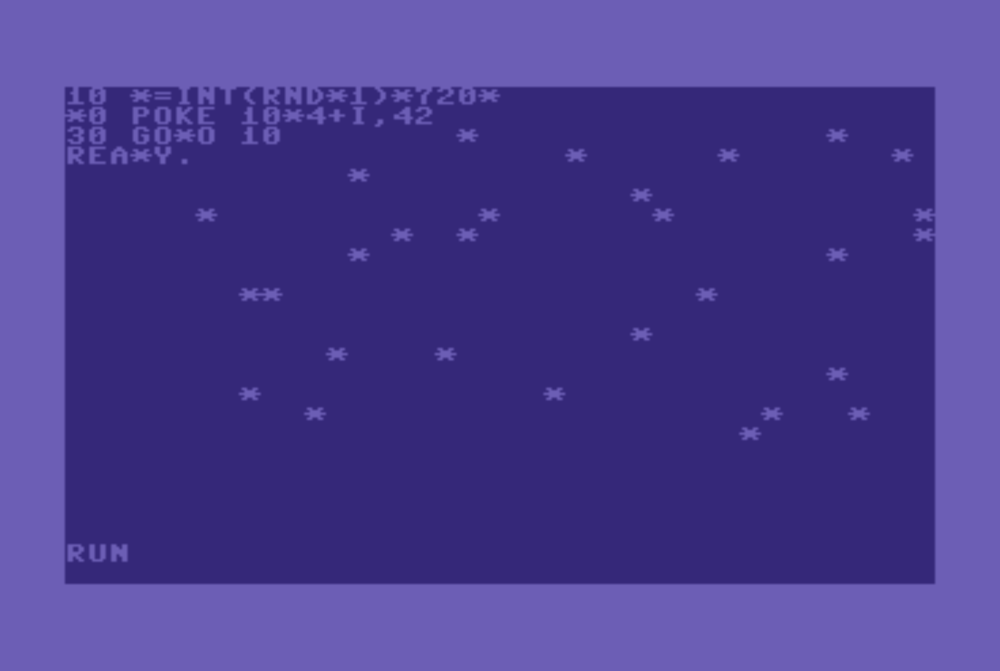
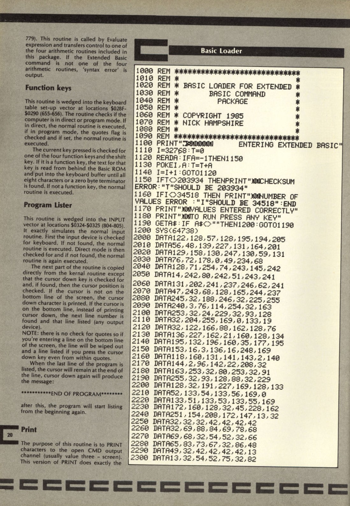
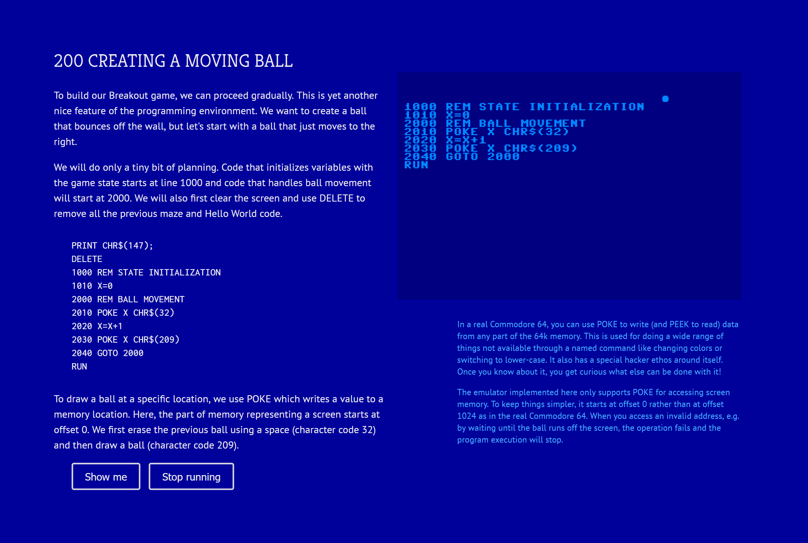
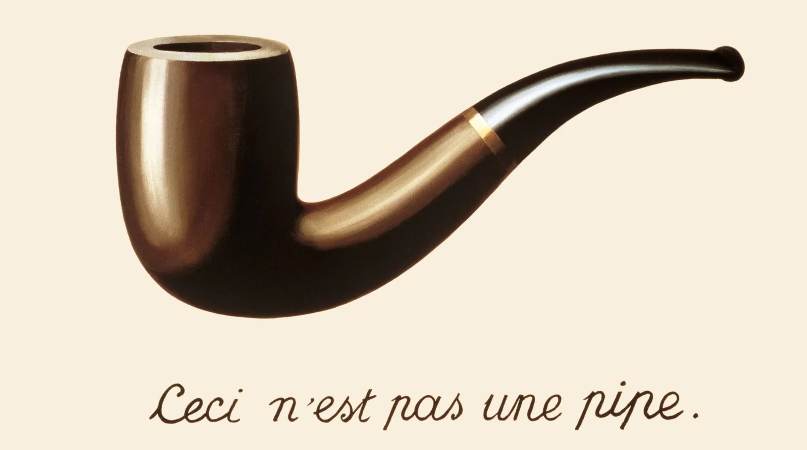

- title: Principles of Programming Languages - Lab #4 (NPRG084)

*****************************************************************************************
- template: title

# NPRG084
## **Lab #4**: Imperative BASIC interpreter

---

**Tomáš Petříček**, 204 (2nd floor)  
_<i class="fa-brands fa-discord"></i>_ Materials available via course Discord!  
_<i class="fa fa-envelope"></i>_ [petricek@d3s.mff.cuni.cz](mailto:petricek@d3s.mff.cuni.cz)  
_<i class="fa-solid fa-circle-right"></i>_ [https://tomasp.net](https://tomasp.net) | [@tomasp.net](https://bsky.app/profile/tomasp.net)  

*****************************************************************************************
- template: subtitle

# BASIC
## What makes the language interesting?

-----------------------------------------------------------------------------------------
- template: image
- class: smaller



# BASIC as a language?

**Edsger Dijkstra on BASIC...**

---

It is practically impossible to teach good program&shy;ming to students that have
had a prior exposure to BASIC: as potential prog&shy;rammers they are mentally
mutilated beyond hope of regeneration.

-----------------------------------------------------------------------------------------
- template: lists

# Reasoning about programs


## Functional languages
- Compositional semantics
- Define meaning of $e_1 + e_2$ in  
  terms of the meaning of $e_1$ and $e_2$

## Imperative languages
- What is the meaning of `PRINT "HI"`?
- What is the meaning of `GOTO 10`?
- Whatever the interpreter does..
- Not very good for program proofs!

-----------------------------------------------------------------------------------------
- template: code
- class: smaller

```basic
 00  REM FACTORIAL IN BASIC
 10  Q = 5                                  
 20  N = 1                                  
 30  F = 1                                  
 40  IF N=Q THEN GOTO 100                 
 50  N = N + 1                                
 60  F = F * N                                
 70  GOTO 40                              
100  PRINT F
```

# Reasoning about BASIC programs

**Hoare triples** $\{P\}c\{Q\}$

**Pre-condition $P$** what is true before the command execution

**Post-condition $Q$** what is true after the command execution

-----------------------------------------------------------------------------------------
- template: image
- class: smaller



# Reasoning about BASIC programs

**Postconditions** of a command before have to match
**preconditions** of a command after

Coming up with the right properties is tricky!

-----------------------------------------------------------------------------------------
- template: lists

# Why look at BASIC?



## BASIC as a programming system

- Right at the birth of microcomputers
- Part of an early computing culture
- Interesting mode of interaction!

## BASIC as a programming problem

- Interpreter with richer state
- Statements vs. expressions
- More interesting F# programming!


-----------------------------------------------------------------------------------------
- template: image



# Demo
## Writing BASIC in C64 emulator

Realistic machine-level system emulator

All the clever hacks with `POKE` work!

See: [C64 emulator](https://virtualconsoles.com/online-emulators/c64/)

-----------------------------------------------------------------------------------------
- template: lists

# What is interesting about it?



## Learnability
- Your computer boots into BASIC
- Copy games code from magazines

## From novice to hacker
- Easy to write basic programs
- Much more with `POKE` and `SYS`!

## Interaction mode
- Code editor and REPL at the same time

-----------------------------------------------------------------------------------------
- template: image



# Demo
## My C64 essay

**Explore the interaction**  
How it helps write, test and debug code?

**Not fully accurate**  
Program does not live in memory, `POKE` offsets are wrong


*****************************************************************************************
- template: content

# F# language
## Console and list processing

-----------------------------------------------------------------------------------------
- template: code
- class: smallcode

```ocaml
let l1 = [1; 2; 3; 4]
let l2 = 1::2::3::4::[]
let l3 = [1..4]

(* Pattern matching lists *)
match list with
| [e1; e2] -> (...)
| el::els -> (...)
| [] -> (...)

(* Possible, but not very useful *)
let (e::es) = list
let foo [e1;e2] = (...)

(* Higher-order list functions *)
let twice x = x * x
List.map twice [1..10]
List.map (fun x -> x * x) [1..10]
List.sum [1..10]
```

# List constructors and list patterns

**List type** written as
`list<int>` or `int list`

Constructed using `::` (rare) and
`[..]` (often)

Patterns `::` and `[..]` can appear anywhere, but are partial

-----------------------------------------------------------------------------------------
- template: subtitle

# Demo
## Real-world list processing (1/2)

-----------------------------------------------------------------------------------------
- template: image



# The pipe operator

**Fluent style for functional data processing**

`let (|>) x f = f x`

In bash scripting (`|`), adopted by R (`%>%`), maybe JavaScript

-----------------------------------------------------------------------------------------
- template: subtitle

# Demo
## Real-world list processing (2/2)

*****************************************************************************************
- template: subtitle

# BASIC interpreter
## Code structure and steps

-----------------------------------------------------------------------------------------
- template: code
- class: smaller smallcode

```ocaml
type Value = (* .. *)
type Expression = (* .. *)

type Command =
  (* Jumps and subroutines *)
  | Goto of int
  | GoSub of int
  | Return
  (* I/O operations *)
  | Clear
  | Print of Expression list
  | Input of string
  (* If, variables and control *)
  | If of Expression * Command
  | Assign of string * Expression
  | Run
  | Stop

```

# BASIC interpreter structure (1/2)

**Expressions** evaluate to **Values** and are simple

**Commands** contain all the operations that modify the program state

-----------------------------------------------------------------------------------------
- template: code
- class: smaller smallcode

```ocaml
(* State of the interpreter stores
   program lines as sorted list,
   variables in a dictionary,
   generator for the RND function
   and stack for GOSUB/RETURN *)
type State =
  { Program : list<int * Command>
    CurrentLine : int
    Variables : Map<string, Value>
    Random : System.Random
    CallStack : int list }

(* Evaluate a command and
   return a modified state
 : Cmd -> State -> State *)
let runCommand state (line, cmd) =
  (* ... *)

(* Run the program from start
   to end & return unit. *)
let runProgram state =
  (* .. *)
```

# BASIC interpreter structure (2/2)

**State** is the program source code, variables  
(and a few extras)

**Current line** is also  
a part of the state

-----------------------------------------------------------------------------------------
- template: subtitle

# Demo
## BASIC Hello World

-----------------------------------------------------------------------------------------
- template: code
- class: smaller

```basic
REM You can write comments!
REM Jumping and calls
GOTO 10
GOSUB 10
RETURN

REM Printing to the screen
POKE 1024 CHR$(42)
PRINT "HELLO ";X
INPUT "ENTER A VALUE";X

REM Variables and ifs
X=10
IF (X>0) GOTO 10

REM Control
RUN
STOP
```

# BASIC basics

`GOSUB` jumps, but keeps return location on stack  
for `RETURN`

`PRINT` takes a sequence of expressions (and we ignore cursor moving)

`POKE` writes a byte to memory (we will cheat)

We ignore command chaining (`:`)

-----------------------------------------------------------------------------------------
- template: content
- style: p, li { font-size:30pt; margin-bottom:6px; } p { margin-bottom:30px; }

# Lab #4 - Tasks

- **1. Basic** - Hello world - printing & goto
- **2. Basic** - Conditionals and variables
- **3. Basic** - For loops with loop stack
- **4. Basic** - Flat memory model for variables
- **5. (Bonus)** - Putting random stars on the screen!
- **6. (Bonus)** - NIM game and adding GOSUB
