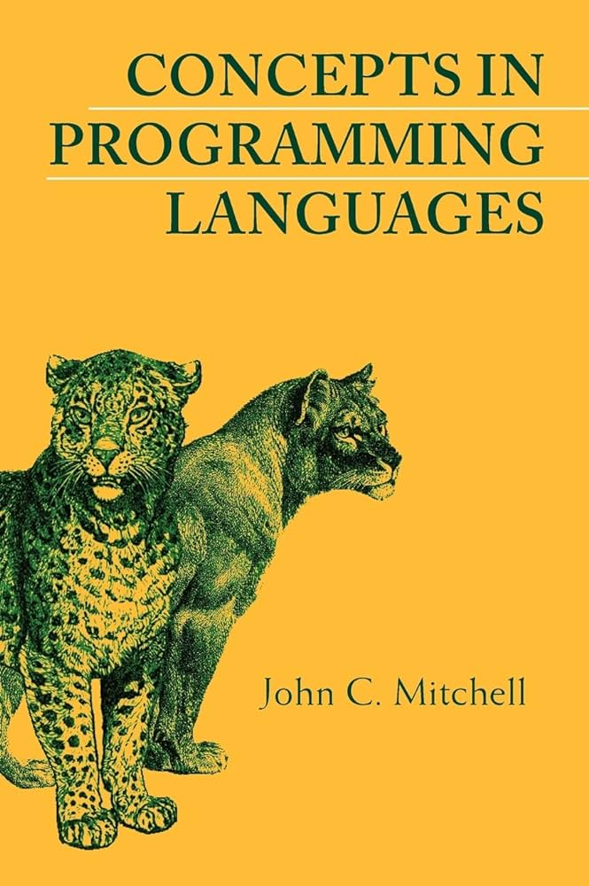
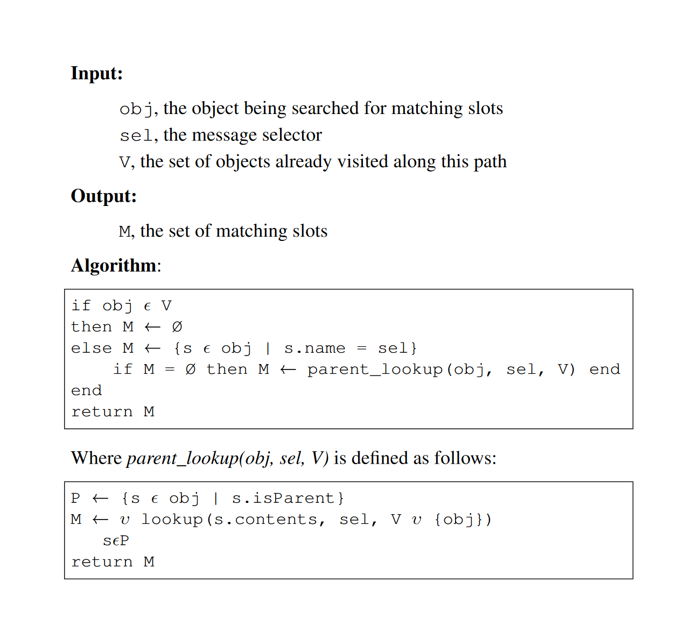
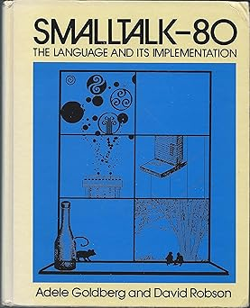

- title: Principles of Programming Languages - Lab #5 (NPRG084)

*****************************************************************************************
- template: title

# NPRG084
## **Lab #5**: Object-oriented languages

---

**Tomáš Petříček**, 204 (2nd floor)  
_<i class="fa-brands fa-discord"></i>_ Materials available via course Discord!  
_<i class="fa fa-envelope"></i>_ [petricek@d3s.mff.cuni.cz](mailto:petricek@d3s.mff.cuni.cz)  
_<i class="fa-solid fa-circle-right"></i>_ [https://tomasp.net](https://tomasp.net) | [@tomasp.net](https://bsky.app/profile/tomasp.net)  

*****************************************************************************************
- template: subtitle

# OOP languages
## Background

-----------------------------------------------------------------------------------------
- template: image
- class: smaller



# Object-orientation

**Dynamic lookup** - object chooses how to respond

**Abstraction** - object state can be hidden from user

**Subtyping** - any compatible object can be used

**Inheritance** - reuse to implement a new object

-----------------------------------------------------------------------------------------
- template: lists

# Classes and prototypes


## Class-based OOP

- Object has a class
- Object stores data fields
- Class stores methods
- Classes have superclasses

## Prototype-based OOP

- Object has method and data slots
- Object has other objects as parents

-----------------------------------------------------------------------------------------
- template: code
- class: smaller smallcode

```fsharp
// Slot inside an object
type Slot =
  { Name : string
    Value : Objekt }

// Has a list of slots and
// can be a special thing
and Objekt =
  { Slots : list<Slot>
    Special : option<Special> }

// Primitive strings and
// executable methods
and Special =
  | String of string
  | Code of (Objekt -> Objekt)
```

# Everything is<br> an object

**Objekt** represents an  
object with slots

Two **Special** cases

- Strings to store values!
- Methods are F# functions

-----------------------------------------------------------------------------------------
- template: subtitle

# Sketch
## Prototype-based OOP

-----------------------------------------------------------------------------------------
- template: imageanim
- class: image



# Slot lookup in Self

---

**Find a set of  
matching slots**

1) Search target object

2) Search parents and union the results

3) Avoid infinite loops!

-----------------------------------------------------------------------------------------
- template: content
- class: two-column

# Message sending logic

### Self handbook

> A normal send does a look&shy;up to obtain the target slot;
>
> If the slot contains a data object, then the data object is simply returned.
>
> If the slot contains a method, an activation is created and run.

----

### TinySelf translation

1. Find slot using lookup!
2. Check it is exactly one
3. If there is no code, return it
4. If there is code, run it...
   * Create activation record
   * Run native F# function

-----------------------------------------------------------------------------------------
- template: subtitle

# Sketch
## Class-based OOP

-----------------------------------------------------------------------------------------
- template: lists
- class: smaller
- style: li { margin:0px; } ul { margin-bottom:20px; }

# Class-based lookup & sends



## Accessing data slot

- Look for slots in the instance!

## Calling a method

- Find the method in class hierarchy
- Invoke the method

## Find method in a class

- Get object's class (object)
- Find matching method slot
- If none, search the superclass


-----------------------------------------------------------------------------------------
- template: subtitle

# Sketch
## Activation records

*****************************************************************************************
- template: subtitle

# OOP languages
## Code structure and steps

-----------------------------------------------------------------------------------------
- template: content
- class: two-column smallcode

# Lab #5 programming style

### Different than before!

**Everything is an `Objekt`**  
Type definition stays  
We change what we put in!

**Uniformity has drawbacks**
Everything type checks!

---

### Helper methods

**Simplify object construction**  
But it's just an object graph!

```fsharp
let greeter = makeObject [
  "greet", makeMethod (fun obj ->
    makeString "Hello world!"
  )
]
```

-----------------------------------------------------------------------------------------
- template: subtitle

# Demo
## TinySelf object visualizer

-----------------------------------------------------------------------------------------
- template: content
- style: p, li { font-size:30pt; margin-bottom:6px; } p { margin-bottom:30px; }

# Lab #5 - Tasks

### Prototype-based OOP

- **1. Basic** - Prototypes and slot lookup
- **2. Basic** - Adding method calls
- **3. Basic** - Passing arguments with activations
- **4. (Bonus)** - Booleans and if expression

### Class-based OOP

- **5. Basic** - Class-based method lookup
- **6. (Bonus)** - Arguments and minimal reflection
